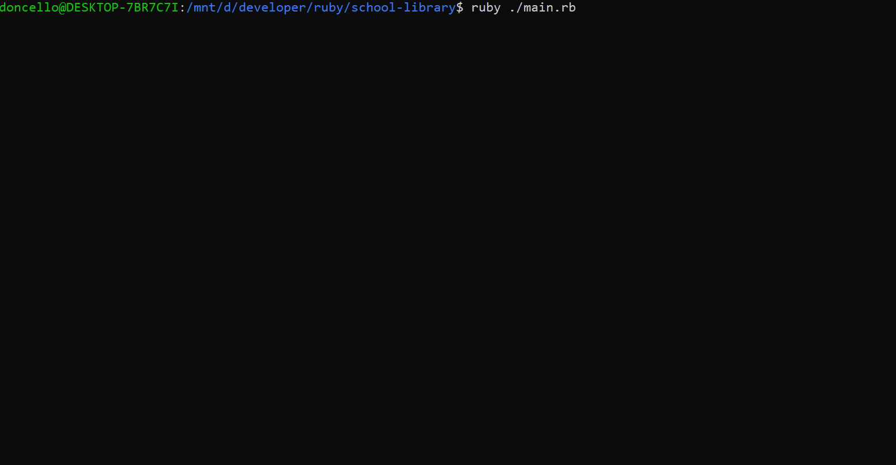

# School Library

Imagine that you are the librarian of OOP University, and you need a tool to record what books are in the library and who borrows them. The app that you will create will allow you to:

- Add new students or teachers.
- Add new books.
- Save records of who borrowed a given book and when.

And all of this will be built in a beautiful and well-organized way!

## Built With

- Ruby

## How to run

```
git clone https://github.com/damdafayton/ruby-school-library
cd ruby-school-library
```

Remove the empty line at the beginning of `main.rb` file.

Open bash or wsl ubuntu and type
`./main.rb`

If that doesnt work

`ruby ./main.rb`

## Authors

👤 **damdafayton**

- [Github](https://github.com/damdafayton)
- [LinkedIn](https://linkedin.com/in/damdafayton)

👤 **Muneeb Ul Rehman**

- GitHub: [@Muneeb](https://github.com/muneebulrehman)
- Twitter: [@NeatCoder\_](https://twitter.com/NeatCoder_)
- LinkedIn: [Muneeb](https://www.linkedin.com/in/muneeb-ul-rehman-33903b159/)

## 🤝 Contributing

Contributions, issues, and feature requests are welcome!

Feel free to check the [issues page](../../issues/).

## Show your support

Give a ⭐️ if you like this project!

## 📝 License

This project is [MIT](./MIT.md) licensed.
